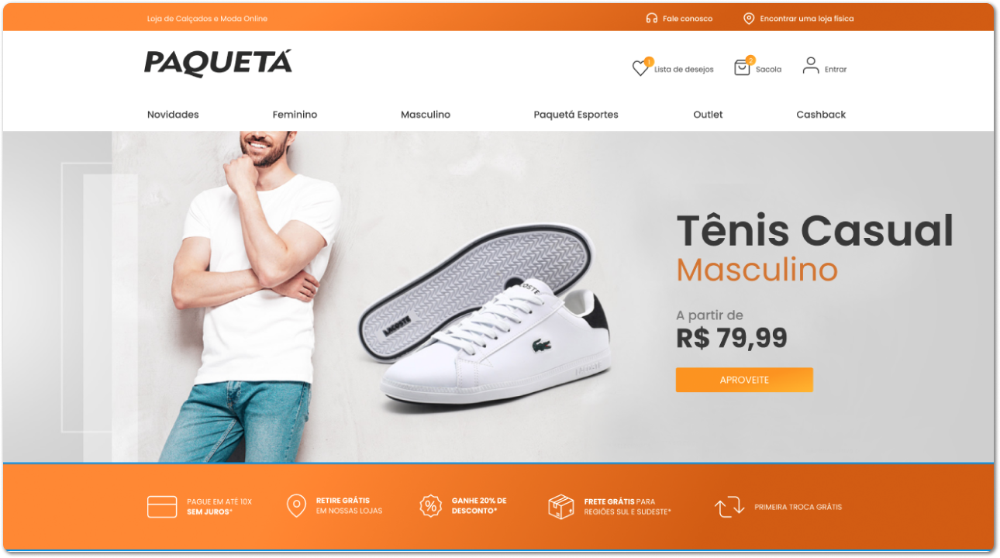

<h1 align="center">
  
</h1>

  

## 💻 Projeto

Neste desafio, você será responsável por fazer o redesign do site da empresa **Paquetá Calçados**. A Paquetá Calçados é uma renomada marca de calçados que busca expandir sua presença online e oferecer aos seus clientes uma experiência digital atraente e funcional.

A autora do layout é a design [**Ana Maria Almeida**](https://www.linkedin.com/in/anamariawca/), [clique aqui](https://www.brchallenges.com/desafio/paqueta-calcados) para saber mais detalhes do desafio.

## 🚀 Tecnologias

- [Item 1](http://localhost:3000/)
- [Item 2](http://localhost:3000/)
- [Item 3](http://localhost:3000/)

## 📝 Requisitos do desafio

### Nível Fácil

- [ ]  Criar todas a seções da [Homepage(versão simples)](https://www.figma.com/file/df5XIaBPlnvzkMNUxhLFpq/Paqueta---BrChallenges?type=design&node-id=105-38&t=r9LrrJRYu6XI8cnW-0).

- [ ]  Usar a propriedade `object-fit: cover` para posicionar a [imagem do banner hero](https://www.figma.com/file/df5XIaBPlnvzkMNUxhLFpq/Paqueta---BrChallenges?type=design&node-id=115-57&t=iAA31lEBc7NQJqfs-0).

- [ ]  Criar o efeito gradiente nas imagens Calçados Femininos e Calçados Masculinos com o uso da propriedade `linear-gradient`.

- [ ]  As logos da [seção Marcas](https://www.figma.com/file/df5XIaBPlnvzkMNUxhLFpq/Paqueta---BrChallenges?type=design&node-id=115-57&t=OT0QzAk3qKoEWrZy-0), deverão estar espaçadas com o uso da propridade `justify-content: space-between`. 

### Nível Médio
### 

- [ ]  Todos os requisitos do nível fácil.

- [ ]  Criar todas a seções da [Homepage(versão completa)](https://www.figma.com/file/df5XIaBPlnvzkMNUxhLFpq/Paqueta---BrChallenges?type=design&node-id=103-679&t=KjhTrIQyjw2wYAmO-0).

- [ ]  Todos os produtos devem ser listado de forma dinâmica atráves do endpoint [/shoes](https://api.brchallenges.com/api/paqueta/shoes) da API.

- [ ]  No card do produto deverá conter a [flag produto esgotado](https://www.figma.com/file/df5XIaBPlnvzkMNUxhLFpq/Paqueta---BrChallenges?type=design&node-id=103-679&t=iAA31lEBc7NQJqfs-0) caso a propriedade **soldout** seja igual a true.

- [ ]  Criar um carrousel para navegar na listagem dos produtos, por padrão será mostrado quatro produtos.

- [ ]  Criar efeito de `hover` ao passar o mouse por cima do botão Comprar, localizado no card do produto.

### Nível Difícil

- [ ]  Todos os requisitos do nível fácil e médio.

- [ ]  Construir a tela do produto e consumir os dados via API.

- [ ]  Ao clicar no botão Comprar, o produto deverá ser adicionado no carrinho de compras. Como o carrinho está em outra tela, você pode usar o `localstorage` para armazenar os produtos do carrinho.

- [ ]  Ao clicar no ícone de coração, o produto será adicionado na lista de favoritos e o ícone de coração deverá mudar de estado.

- [ ]  Ao clicar em um tamanho de sapato, deverá alterar o estilo do botão para ativo. 

- [ ]  Na tela do produto, o valor do produto deverá ser calculado de forma dinâmica caso a propriedade price.discount esteja preenchida, o valor original deverá conter um strike e ao lado será exibido um balão com a porcentagem do desconto(price.discount * 100) e logo abaixo será exibido o novo valor do produto.

- [ ]  Ao clicar no botão Guia de tamanhos, deverá ser exibido o [modal](https://www.figma.com/file/df5XIaBPlnvzkMNUxhLFpq/Paqueta---BrChallenges?type=design&node-id=105-341&t=rnt2oL4c4WTWskKy-0) com as informações de cada tamanho de sapato.
